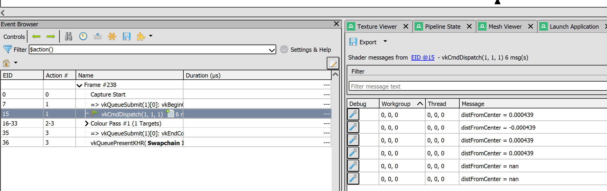

# sim-vk-rend (unorganized notes)

## msvc compiler version

install multiple msvc compiler in windows 11
do both installation in vs 2022 and vs build tool 2022

### MSVC 19.40.33817.0: good version for threading but bad for cuda: 
The C compiler identification is MSVC 19.40.33817.0
The CXX compiler identification is MSVC 19.40.33817.0

### older msvc compiler: specify compiler 
cmake ... -T v143,version=14.38
Either remove the CMakeCache.txt file and CMakeFiles directory or choose a different binary directory.
access violation in vulkan driver api was ran into.

## cmake notes

### FetchContent_GetProperties

This command is rarely needed when using FetchContent_MakeAvailable(). 
It is more commonly used as part of implementing the deprecated pattern with FetchContent_Populate()

## cuda and vulkan interop

### step1: extra instance extensions

An application may wish to reference device semaphores in multiple Vulkan logical devices or instances, in multiple processes, and/or in multiple APIs

    extensions.push_back(VK_KHR_EXTERNAL_MEMORY_CAPABILITIES_EXTENSION_NAME);
    extensions.push_back(VK_KHR_EXTERNAL_SEMAPHORE_CAPABILITIES_EXTENSION_NAME);
    extensions.push_back(VK_KHR_EXTERNAL_FENCE_CAPABILITIES_EXTENSION_NAME);

### step2: extra device extensions

VK_KHR_external_memory - device extension

This extension enables an application to export non-Vulkan handles from Vulkan memory objects such that the underlying resources can be referenced outside the scope of the Vulkan logical device that created them.

### step2: matching device

## multi-threading + command buffer
1. separate command pool per thread

## dynamic rendering after v1.3

## Frame debugger with renderdoc v1.25

### unsupported instance extensions
VK_KHR_portability_enumeration
VK_LUNARG_direct_driver_loading
VK_EXT_layer_settings

### unsupported device extensions (vendor and ray tracing)
VK_NV_MESH_SHADER_EXTENSION_NAME

### shader debug printf

## GPU profiling with Tracy Profiler

### 1. cmake side
-DTRACY_CALLSTACK=ON -DTRACY_ENABLE=ON (default)

### 2. dedicated command buffer foir tracy only

### 3. tracy with vulkan
TracyVkZone: your real cmdbuffer not the tracy dedicate cmd buffer
Tr

## How to design architecture of misc rendering passes 

### What are the components of a rendering pass

1. shader modules
2. input
3. output

mixing class

## vulkan small tips 

https://docs.vulkan.org/guide/latest/push_constants.html

computing pipeline and graphics pipeline have independent resource binding

## push constant
https://docs.vulkan.org/guide/latest/push_constants.html#pc-shader-code

A small bank of values writable via the API and accessible in shaders. Push constants allow the application to set values used in shaders without creating buffers or modifying and binding descriptor sets for each update.

From a shader perspective, push constant are similar to a uniform buffer

### update push constant

1. VkPipelineLayoutCreateInfo's two fields: pushConstantRangeCount & pPushConstantRanges

2. update push constant: vkCmdPushConstants

### Specialization Constants vs push constant
Specialization Constants: massage upon shaders
push constant: a descriptor set -less uniform data pass-in.

specialization constants: are set before pipeline creation meaning these values are known during shader compilation,

push constant: update at runtime (after shader compilation)

### barrier between compute queue and graphcis queue

### pipeine, ds and resource
1. bind resource to ds
2. bind ds to the pipeline for shader to access

## Ray tracing
### device extensions
        VK_KHR_RAY_TRACING_PIPELINE_EXTENSION_NAME, // ray_tracing_present        VK_KHR_ACCELERATION_STRUCTURE_EXTENSION_NAME, // for ray tracing
        VK_KHR_DEFERRED_HOST_OPERATIONS_EXTENSION_NAME, // for ray tracing
        VK_KHR_RAY_QUERY_EXTENSION_NAME,                // ray query needed for raytracing
### enable the feature for logic device 
        sAccelStructFeatures.accelerationStructure = VK_TRUE;
        sRayTracingPipelineFeatures.rayTracingPipeline = VK_TRUE;
        sRayQueryFeatures.rayQuery = VK_TRUE;

### sbt (shader binding table)

### BLAS 
mesh

### TLAS
instancing

### camera properties
viewInverse
prjInverse

## dynamicRendering
renderPass updates

## Normal Uniform Buffer vs Dynamic Uniform Buffer

### Dynamic
1. desc: one combo shared
2. benifits: minimizes the number of descriptor sets required and may help in optimizing memory writes.

INFO:  GPU Used: NVIDIA GeForce RTX 4090 Laptop GPU Vendor: 4318 Device: 10071
INFO: minUniformBufferOffsetAlignment: 64

vkCmdBindDescriptorSets's param:    

    uint32_t                                    dynamicOffsetCount,
    const uint32_t*                             pDynamicOffsets

### By introducing Dynamic UBO, what changes should I make ? 
1. ds pool
2. pipeline layout bindings
3. ds related to the ubo

## Use Case: multiple objects to render with different uniform values

### Implement with uniform buffers
allocate multiple uniform buffers and descriptor sets

### Implement with dynamic ubo
allocate 1 uniform buffers and descriptor set
but bind descriptorset with different offset

### Implement with push constant
no buffer needed, 
vkCmdPushConstants before draw command : change them on a per-mesh or per-pass basis.
